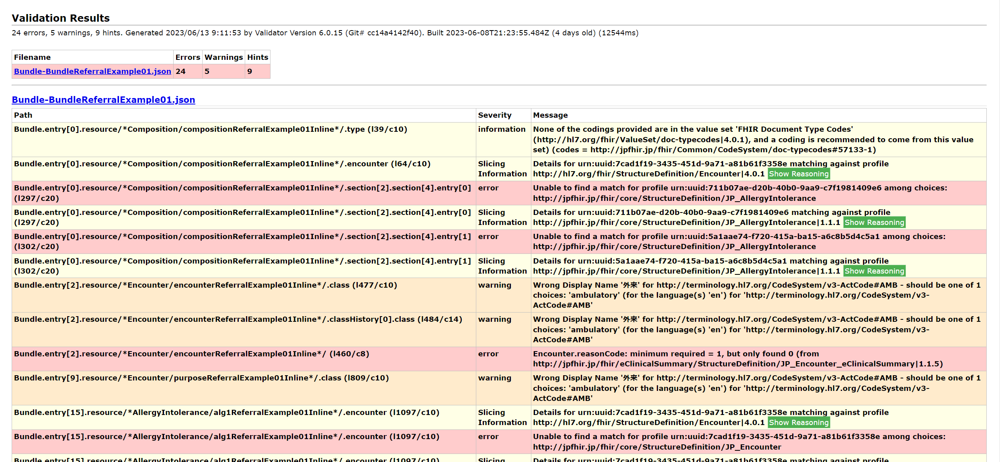

# 診療情報提供書FHIR記述仕様のプロファイルを使ったバリデーション実行

* [https://std.jpfhir.jp/](https://std.jpfhir.jp/)のサイトにある、[「packageの説明と使い方」](http://std.jpfhir.jp/wp-content/uploads/2023/05/eReferral-Package-readme-v2-1.pdf)の手順に基づき、診療情報提供書FHIR記述仕様のプロファイルを[公式バリデータ](https://confluence.hl7.org/display/FHIR/Using+the+FHIR+Validator)使ってバリデーション実行した例です。
    * Validatorの使用方法については[HL7のConfluenceのページ「Using the FHIR Validator」](https://confluence.hl7.org/display/FHIR/Using+the+FHIR+Validator)を参照ください。

## 実行のための手順

1. Open JDKのインストール
    * 公式Validatorの実行にJavaの実行環境が必要です。
        * [公式Validatorのドキュメント](https://confluence.hl7.org/display/FHIR/Using+the+FHIR+Validator#UsingtheFHIRValidator-JDKVersion)によると、現在サポートされているLTSバージョン（JDK11、17）での実行が確認済のこと
    * 例えば、[Amazon Corretto](https://aws.amazon.com/jp/corretto)等、何らかのOpen JDKのディストリビューションをインストールしてください。

1. 診療情報提供書のsnapshot形式のパッケージダウンロード
    * 診療情報提供書のsnapshot形式（親profileの記述をすべて含んだ上でそれに差分を反映した形式）の[FHIR package仕様](https://registry.fhir.org/learn)に従ったパッケージをダウンロードします。
        * [IGpackage2023.4.27 snapshot形式: jp-ereferral-0.9.6-snap.tgz](https://jpfhir.jp/fhir/eReferral/jp-ereferral-0.9.7-snap.tgz)
        * 現状2023/06/10時点で、Webページの表記は「0.9.6」となっていますが、ダウンロードリンク先のファイルの実際のバージョン番号は「0.9.7」(jp-ereferral-0.9.7-snap.tgz)になっています。

1. パッケージのtgzファイルのファイル名変更
    * 「jp-ereferral-0.9.x-snap.tgz」から「jp-ereferral#0.9.x.tgz」の形式に名前を変更します。

1. 診療情報提供書のサンプルデータの準備
    * 先ほどダウンロードした「jp-ereferral-0.9.x-snap.tgz」を解凍し、中に含まれている、診療情報提供書のサンプルデータ（Bundle-BundleReferralExample01.json）を取り出しておきます。
        * 解凍には、7Zip等のファイル解凍ソフトを使うとよいです。    
    * もしくは、自分が作成したサンプルデータを使用することもできます。

1. 公式Validatorのダウンロード
    * HAPI FHIRが提供する[公式Validtor（validator_cli.jar）](https://github.com/hapifhir/org.hl7.fhir.core/releases/latest/download/validator_cli.jar)をダウンロードします。

1. 公式Validatorの実行
    * 以下のjavaコマンドを実行します。        
        * オプションの詳細は「java -jar validator_cli.jar -?」でも確認できます。
            * もしくは、[HL7のConfluenceのページ「Using the FHIR Validator」](https://confluence.hl7.org/display/FHIR/Using+the+FHIR+Validator)を参照ください。        
        * -txオプションはインスタンスで使用されるコード（CodeSystemやValueSet）を格納したFHIR TerminologyサーバのURLだそうです。
            * [https://tx.jpfhir.jp:8081](https://tx.jpfhir.jp:8081)は日本医療情報学会FHIR実装検討WGがボランタリーに稼働しているもので、jp-core.r4 v1.1をサポートしており、メンテナンスでアクセスできない場合もあるとのこと
            * jp-coreのコードやValueSetをvalidationで必要としないのであれば、このオプションは省略可能で、省略した場合にはデフォルトで、「-tx [https://tx.fhir.org/r4](https://tx.fhir.org/r4)」（HL7FHIRのTerminologyサーバ）を指定したことになるとのこと
            * 「-tx n/a」にすると未指定（Terminologyサーバなし）になる模様
            * 参考: [-txオプション](https://confluence.hl7.org/display/FHIR/Using+the+FHIR+Validator#UsingtheFHIRValidator-TerminologyServer)
        * -display-issues-are-warningsのオプションは、Validator V6.06以降で追加で必要になったそうで、これがないと表示名が日本語となっているUS版コードシステムのcodeの使用時にエラー扱いとなるとのこと。
            * 参考: [-display-issues-are-warningsオプション](https://confluence.hl7.org/display/FHIR/Using+the+FHIR+Validator#UsingtheFHIRValidator-Displaywarnings)
    * その他、使えそうなオプション
        * [-output/-html-output/-output-styleオプション](https://confluence.hl7.org/display/FHIR/Using+the+FHIR+Validator#UsingtheFHIRValidator-ManagingOutput)
            * デフォルトでは、標準出力に単純なテキストで出力されるバリデーション結果の、出力先や出力形式を指定可能
            * -html-outputオプションで出力すると、HTMLのレポートが結構見やすい
        * [-levelオプション](https://confluence.hl7.org/display/FHIR/Using+the+FHIR+Validator#UsingtheFHIRValidator-Level)
            * バリデーションのメッセージ出力する最低レベルを指定可能（hints, warnings, errors）
        * [-txLogオプション](https://confluence.hl7.org/display/FHIR/Using+the+FHIR+Validator#UsingtheFHIRValidator-Logging)
            * バリデータの問題でデバッグしたい場合に、validatorがTerminologyサーバへの用語をクエリ（terminology queries）したログが出力可能        
      

## 実行例1
* コマンドの実行例1（-tx オプションあり）    
    * 実行すると、初回、HL7のパッケージ（？）のダウンロード（Fetch）処理が走るようです。
        * 2回目以降は、キャッシュされて、その分は早くなりました。
        * キャッシュは、「%userprofile%\.fhir\package」フォルダに保存される模様
    * 正しいサンプルデータのはずなのに、エラーも出てうまくいかず。。。

```sh
java -Dfile.encoding=UTF-8 -jar validator_cli.jar Bundle-BundleReferralExample01.json -display-issues-are-warnings -ig jp-ereferral#0.9.7.tgz -tx https://tx.jpfhir.jp:8081 -html-output validation.html -txLog txLog.txt
```

* [上記コマンド実行結果のHTML](validation.html)
    * 上記をダウンロードする等してブラウザで見ると、以下のように、結構きれいに見えます。



## 実行例2
* コマンドの実行例2（-tx オプション未指定）    
    * こちらもほぼ同様のエラーで。。。    
```sh
java -Dfile.encoding=UTF-8 -jar validator_cli.jar Bundle-BundleReferralExample01.json -display-issues-are-warnings -ig jp-ereferral#0.9.7.tgz -tx n/a -html-output validation_no_tx.html
```

* [上記コマンド実行結果のHTML](validation_no_tx.html)
